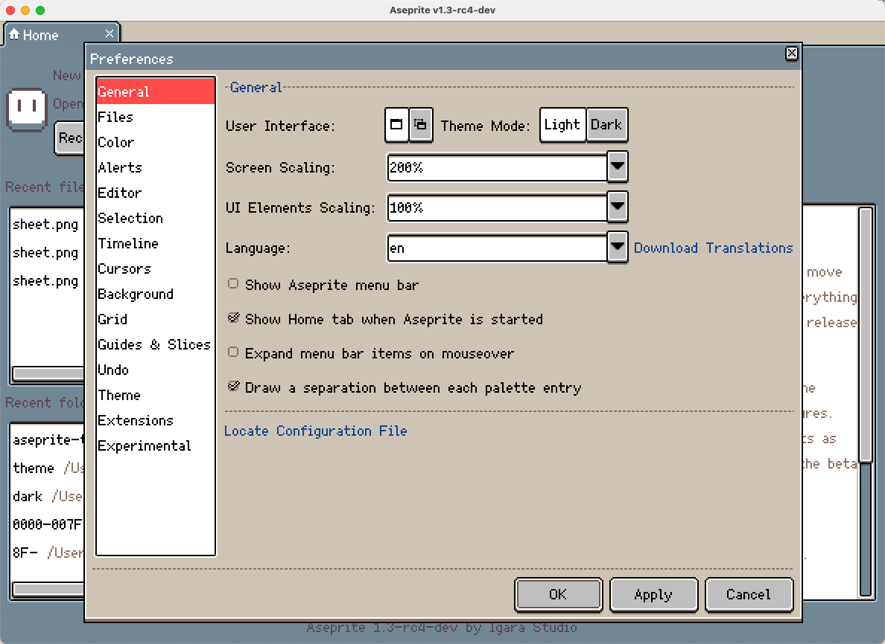
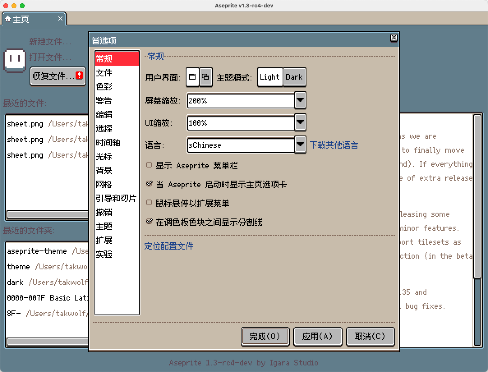
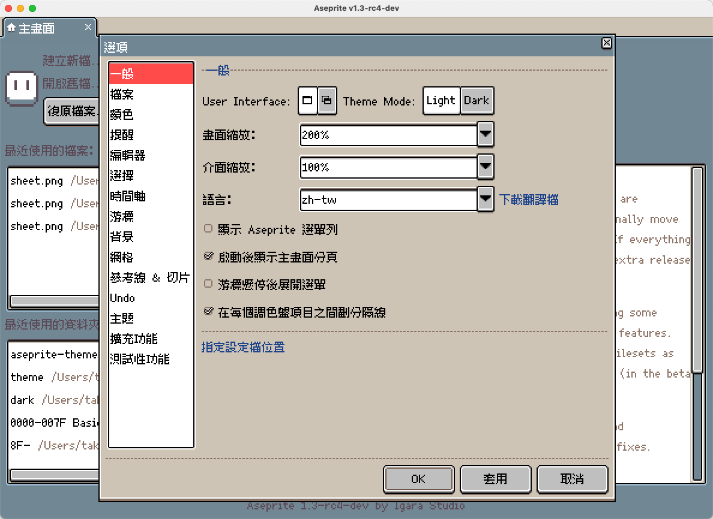
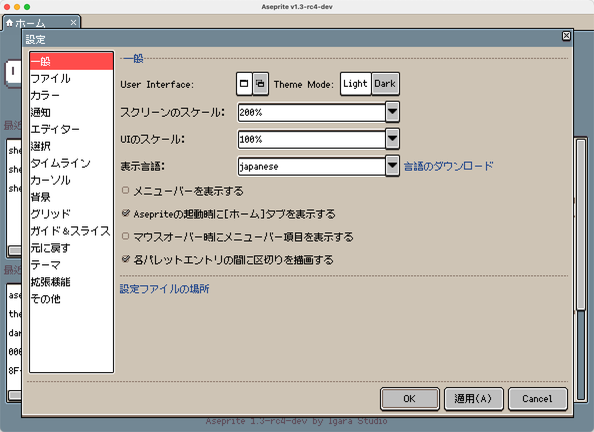
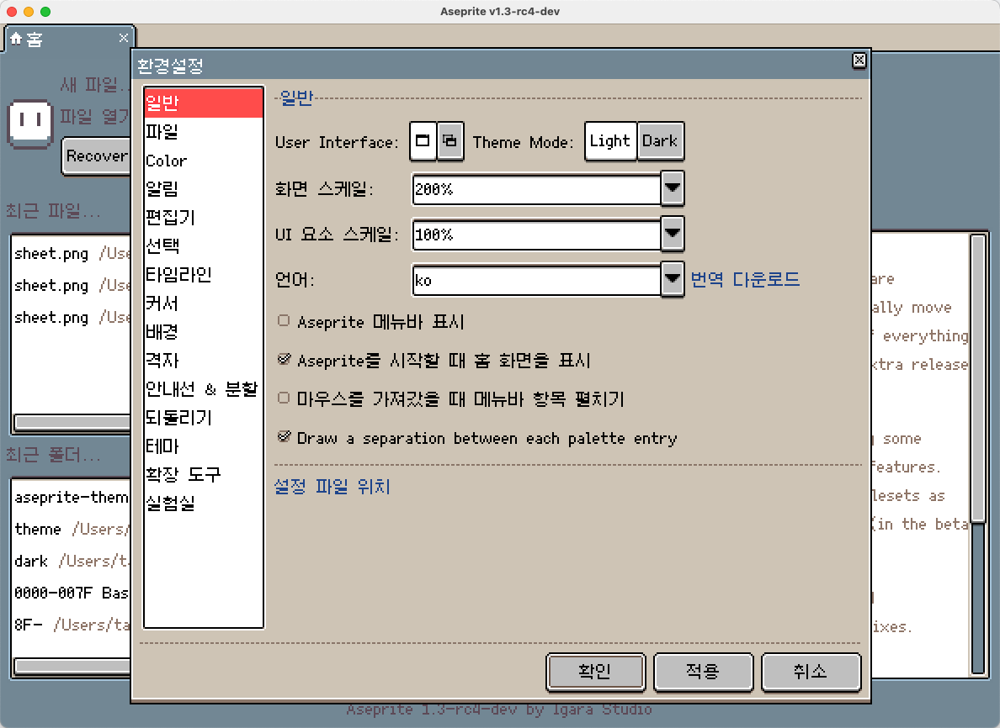
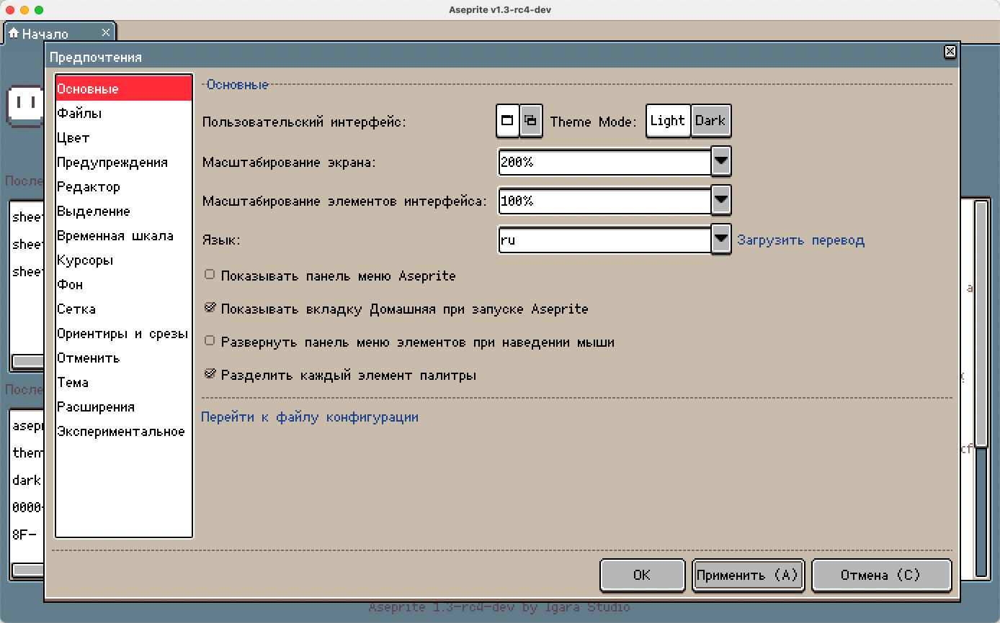
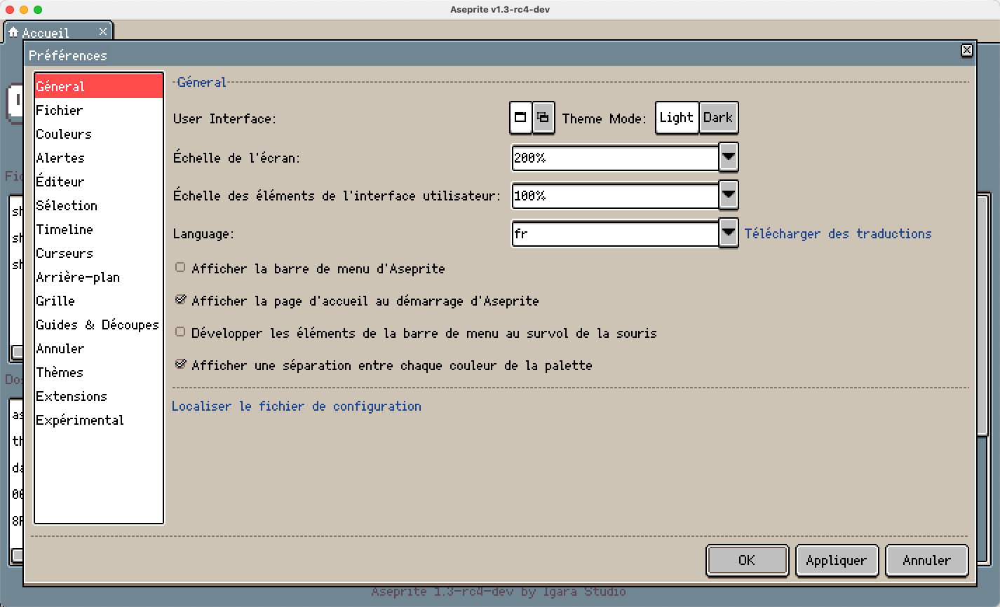
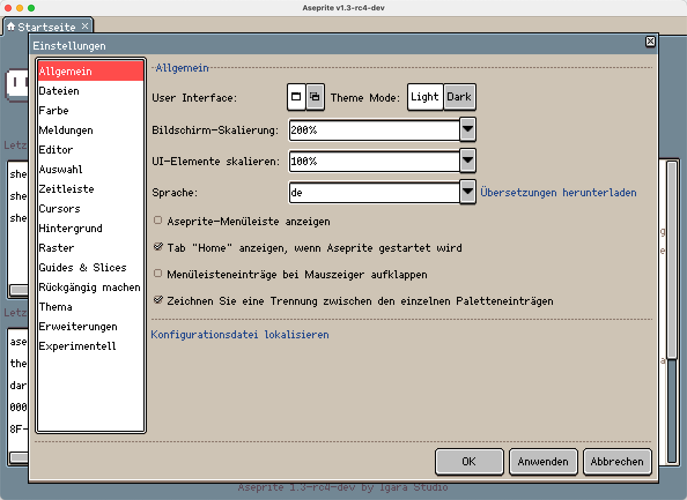
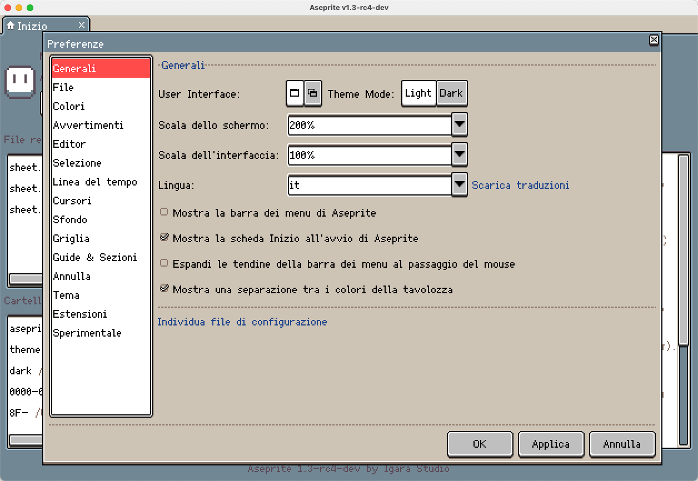

# Aseprite Unified Pixel Theme

[Aseprite](https://github.com/aseprite/aseprite) multilingual supported pixel theme, based on [default theme](https://github.com/aseprite/aseprite/tree/main/data/extensions/aseprite-theme).

Font use [Fusion Pixel Font](https://github.com/TakWolf/fusion-pixel-font).

## Preview

### English

### Simplified Chinese

### Traditional Chinese

### Japanese

### Korean

### Russian

### French

### German

### Italian

## References

- [Aseprite Docs - Extensions - Themes](https://aseprite.org/docs/extensions/themes)

## License

Theme under the Creative Commons Attribution 4.0 International License.

Fonts under the [SIL OPEN FONT LICENSE Version 1.1](https://github.com/TakWolf/fusion-pixel-font/blob/master/LICENSE-OFL).

Scripts under the [MIT License](LICENSE).
